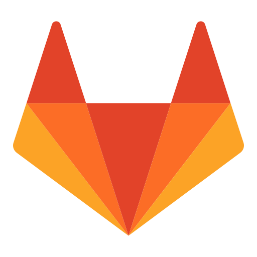

      
```{r setup, include=FALSE}
knitr::opts_chunk$set(echo = FALSE)
library(RUGtools)
```

## Chicago R User Group (CRUG) ...

### Welcome new and returning members of CRUG! Find us online:

<br/>
<div class="row">
<div class="column">
<div class="icon-title">X</div>

<a href="https://twitter.com/ChicagoRusers">@ChicagoRusers</a>
</div>
<div class="column">
<div class="icon-title">Slack</div>

<a href="http://chicagorusergroup.slack.com">chicagorusergroup.slack.com</a>
</div>
</div>
<div class="row">
<div class="column">
<div class="icon-title">Github</div>

<a href="https://github.com/Chicago-R-User-Group">@Chicago-R-User-Group</a>
</div>
<div class="column">
<div class="icon-title">Gitlab <span class="clear">New!</span></div>

<a href="https://gitlab.com/crug-works">@CRUG-Works</a>
</div>
</div>
<div class="row">
<div class="column">
<div class="icon-title">Meetup</div>

<a href="https://www.meetup.com/ChicagoRUG/">ChicagoRUG</a>
</div>
<div class="column">
<div class="icon-title">Website</div>

<a href="https://chicago-r-user-group.github.io/">Chicago-r-user-group.github.io</a>
</div>
</div>

## CRUG Status

<div style="float:right; margin-top:-50px">

</div>

- Still navigating new normal hybrid world
- Aiming for 1-3 meetup events per month or quarter
- Open to new sponsorship as we move on from IBM
- Looking for energetic, new co-organizers of any R level
- Happy to collaborate again with other tech meetups

<br/>

<div class="row">
<div class="meetups column">
<br/>ChiPy
</div>
<div class="meetups column">
<br/>RLadies
</div>
<div class="meetups column">
<br/>PyData
</div>
<div class="meetups column">
<br/>PyLadies
</div>
<div class="meetups column">
<br/>Chicago PUG
</div>
<div class="meetups column">
<br/>Chicago LUG
</div>
</div>


# Who is here today: in-person and online?

## Quick Intros and Announcements

<div class="row">
<div class="meetups column"></div>
<div class="meetups column">
<br/>CRUG Co-Organizers
</div>
<div class="meetups column"></div>
</div>

<div class="row">
<div class="meetups column"></div>
<div class="meetups column">
<br/>RLadies Organizers
</div>
<div class="meetups column"></div>
</div>

<div class="row">
<div class="meetups column"></div>
<div class="meetups column">
<br/>PyData Chicago Organizers
</div>
<div class="meetups column"></div>
</div>

# Anyone hiring R folks?

## Happy Birthday, R!

<div style="text-align:center; margin-top: -50px;">

</div>

- In August 1993, Ihaka and Gentleman posted a binary of R on StatLib — a data archive website. 
- On December 5, 1997, R became a GNU project when version 0.60 was released.
- On February 29, 2000, the first official 1.0 version was released.

- **_When did you first hear about and use R?_**


# Tonight's Event

## Agenda

1. What is Git? Intro and Background
2. CRUG-Works Tour with Merge Request Demo
3. Working Group, Q/A, Discussion, Networking

<div style="text-align:center"></div>

