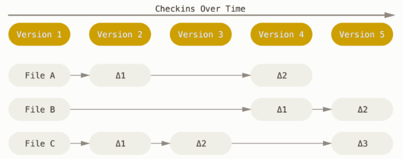
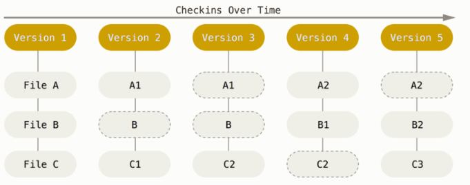
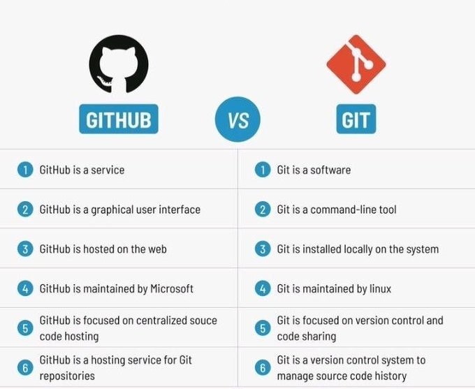
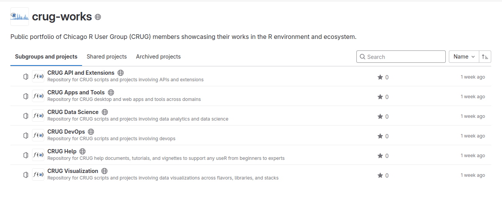

      
```{r setup, include=FALSE}
knitr::opts_chunk$set(echo = FALSE)
library(RUGtools)
```

## Git

<div style="float:right"></div>

- Distributed version control system
- Created by the Linux kernel development team
  - Open-source alternative to struggling commercial solution
  - Needed a simple, fast, fully distributed system
  - Needed to scale well for large projects with many developers
- Command-line or GUI solution at local file system

  
## Pioneering Version Control Storage

- Major Version Control Systems (VCS) use the delta-based version model

<div style="text-align:center"></div>

- Git uses stream of snapshots model (i.e., "mini filesystem") allowing for branching and other features

<div style="text-align:center"></div>


## Git Workflow of Three States

<div style="text-align:center"></div>

  1. Modified: Working tree file(s) were modified 
  2. Staged: Modified file(s) are selected for commit
  3. Committed: Stores changes permanently in local database

## Data Science Benefits

- Facilitates reproducibility, replication, testing, validation, etc. 
- Fosters team collaboration and transparency of scientific method
- Tracks scripts, changes, and authorship across time
- Works across stacks, operating systems, docker containers, and virtualenvs

<div style="text-align:center"></div>


## GitHub != Git 

<div style="text-align:center"></div>

<br/>

<div style="text-align:center"><sub>Others: SQL Server != SQL, XLSX != CSV, XML != TXT</sub></div>


## Popular Git Repositories

-  GitHub: https://github.com/
-  GitLab: https://gitlab.com/
-  BitBucket: https://bitbucket.org/
-  SourceForge: https://sourceforge.net/
-  Perforce: https://www.perforce.com/

<br/>
<hr/>
<div style="font-size: 16px">Note: GitLab is only major repository to provide a free, open-source MIT licensed installation with nearly _all_ features at _zero_ cost.</div>


## Enter: CRUG-Works

- Gitlab public group with six projects: https://gitlab.com/crug-works

<div style="text-align:center"></div>


